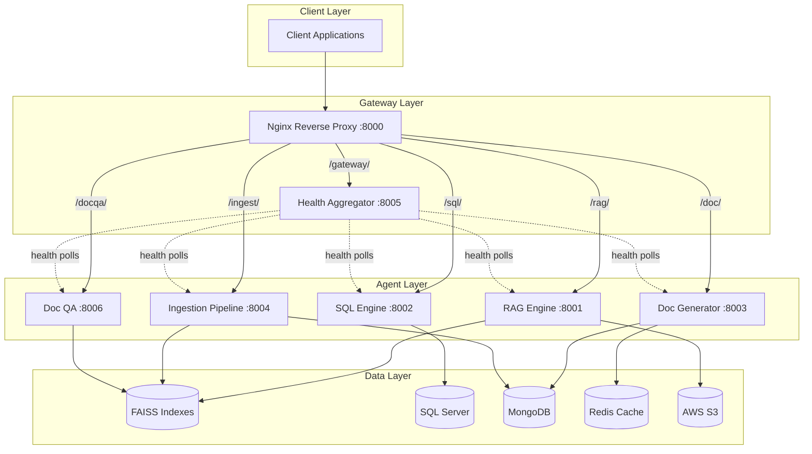

# Agentic AI Platform


Multi-agent AI platform orchestrating 5 specialized intelligence agents behind a unified API gateway. Each agent handles a distinct task -- retrieval-augmented generation, natural language SQL queries, intelligent document generation, data ingestion, and document Q&A -- communicating through a centralized Nginx reverse proxy with health monitoring.

---

## Architecture



---

## Agents

| Agent | Repository | Port | Route | Description |
|-------|-----------|------|-------|-------------|
| RAG Engine | [agentic-rag-engine](https://github.com/AniruddhaPKawarase/agentic-rag-engine) | 8001 | `/rag/` | Retrieval-augmented generation with FAISS & hybrid search |
| SQL Engine | [agentic-sql-engine](https://github.com/AniruddhaPKawarase/agentic-sql-engine) | 8002 | `/sql/` | Natural language to SQL with domain specialists |
| Doc Generator | [agentic-doc-generator](https://github.com/AniruddhaPKawarase/agentic-doc-generator) | 8003 | `/doc/` | AI document generation with hallucination guard |
| Ingestion Pipeline | [agentic-ingestion-pipeline](https://github.com/AniruddhaPKawarase/agentic-ingestion-pipeline) | 8004 | `/ingest/` | Document chunking, embedding & FAISS indexing |
| Doc QA | [agentic-doc-qa](https://github.com/AniruddhaPKawarase/agentic-doc-qa) | 8006 | `/docqa/` | Conversational document Q&A with file upload |
| Gateway | [agentic-gateway](https://github.com/AniruddhaPKawarase/agentic-gateway) | 8000/8005 | -- | Nginx proxy, health aggregation, deploy scripts |

---

## One-Command Clone

```bash
git clone --recurse-submodules https://github.com/AniruddhaPKawarase/agentic-ai-platform.git
```

---

## Quick Start

1. **Clone with submodules:**
   ```bash
   git clone --recurse-submodules https://github.com/AniruddhaPKawarase/agentic-ai-platform.git
   cd agentic-ai-platform
   ```

2. **Set up each agent** (create virtualenv, install deps, configure `.env`):
   ```bash
   cd agents/rag-engine
   python -m venv venv && source venv/bin/activate
   pip install -r requirements.txt
   cp .env.example .env  # Edit with your credentials
   ```
   Repeat for each agent. See the [Deployment Guide](docs/DEPLOYMENT_GUIDE.md) for full instructions.

3. **Configure and start the gateway:**
   ```bash
   sudo cp agents/gateway/nginx/vcs-agents.conf /etc/nginx/sites-available/
   sudo ln -s /etc/nginx/sites-available/vcs-agents.conf /etc/nginx/sites-enabled/
   sudo nginx -t && sudo systemctl reload nginx
   sudo bash agents/gateway/scripts/start-all.sh
   ```

4. **Verify everything is running:**
   ```bash
   curl http://localhost:8000/gateway/health
   ```

---

## Shared Utilities

### S3 Storage Module (`shared/s3_utils/`)

A shared Python package used by all agents for AWS S3 operations:

- **`config.py`** -- Environment-based S3 configuration with `.env` auto-discovery
- **`client.py`** -- Singleton boto3 client with connection pooling and retry logic
- **`operations.py`** -- Upload, download, list, delete, and presigned URL generation
- **`helpers.py`** -- Structured S3 key builders for each agent's data paths
- **`check_connection.py`** -- Diagnostic script to verify S3 connectivity

Toggle S3 storage per agent via `STORAGE_BACKEND=s3` in each `.env` file. Set `STORAGE_BACKEND=local` to fall back to local disk.

---

## Tech Stack


---

## Documentation

| Document | Description |
|----------|-------------|
| [System Design](docs/SYSTEM_DESIGN.md) | Architecture decisions, options analysis, phase roadmap |
| [API Documentation](docs/API_DOCUMENTATION.md) | Complete API reference for all 6 agents |
| [Deployment Guide](docs/DEPLOYMENT_GUIDE.md) | Step-by-step setup on Ubuntu with Nginx and systemd |

---

## Project Structure

```
agentic-ai-platform/
├── agents/
│   ├── rag-engine/          # Submodule → agentic-rag-engine
│   ├── sql-engine/          # Submodule → agentic-sql-engine
│   ├── doc-generator/       # Submodule → agentic-doc-generator
│   ├── ingestion/           # Submodule → agentic-ingestion-pipeline
│   ├── doc-qa/              # Submodule → agentic-doc-qa
│   └── gateway/             # Submodule → agentic-gateway
│       ├── nginx/
│       │   └── vcs-agents.conf
│       ├── services/
│       │   └── *.service
│       ├── scripts/
│       │   └── *.sh
│       └── health_service/
│           └── main.py
├── shared/
│   └── s3_utils/
│       ├── __init__.py
│       ├── config.py
│       ├── client.py
│       ├── operations.py
│       ├── helpers.py
│       └── check_connection.py
├── docs/
│   ├── SYSTEM_DESIGN.md
│   ├── API_DOCUMENTATION.md
│   └── DEPLOYMENT_GUIDE.md
├── docker-compose.yml
├── .gitignore
├── LICENSE
└── README.md
```

---

## License

MIT -- see [LICENSE](LICENSE) for details.
